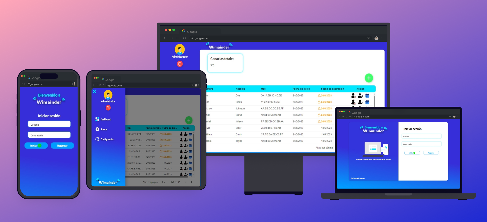

# Wimander

Plataforma para llevar un control de usuarios conectados a una red wifi creando planes de conexión.

wimander permite llevar un seguimiento de la fecha de inicio de la conexión y fecha finalización de la conexión.

## Características

- Creación de usuarios

- Edición de información del usuario

- Coloracion de fecha indicando una Advertencia que un cliente este por alcanzar la fecha limite

- Creación, edición y eliminación de clientes

- Extension del plan de conexión del cliente

- Configuración de valor mensual de la mensualidad

## Demostración

